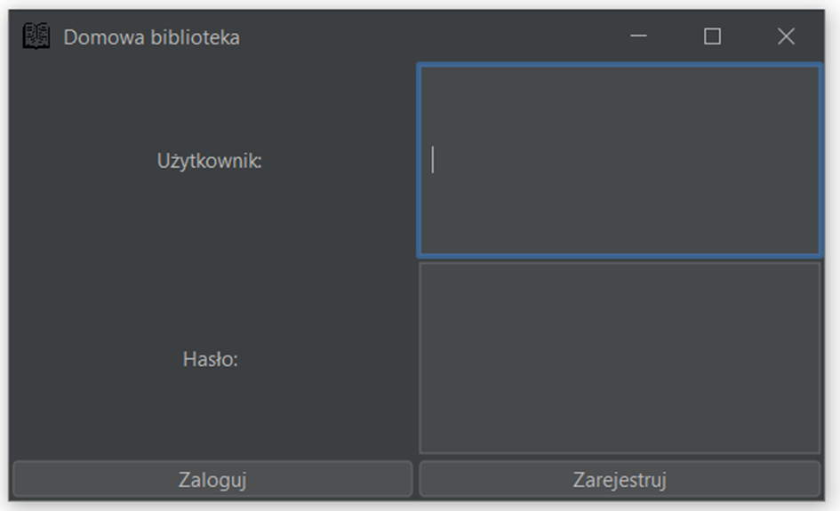
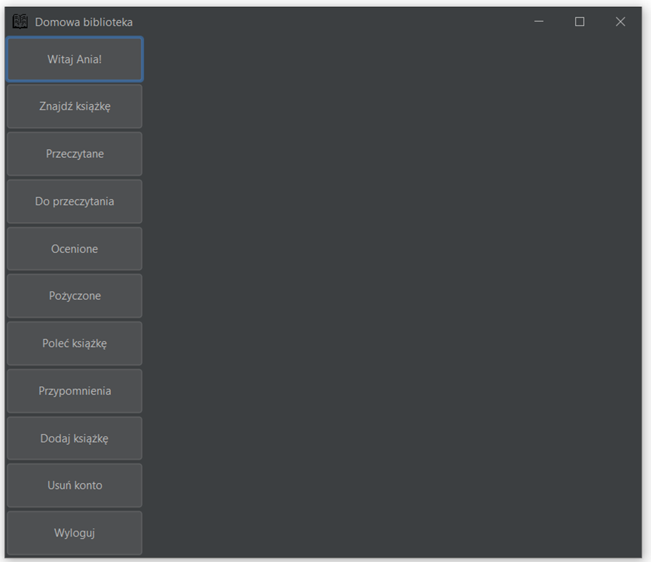
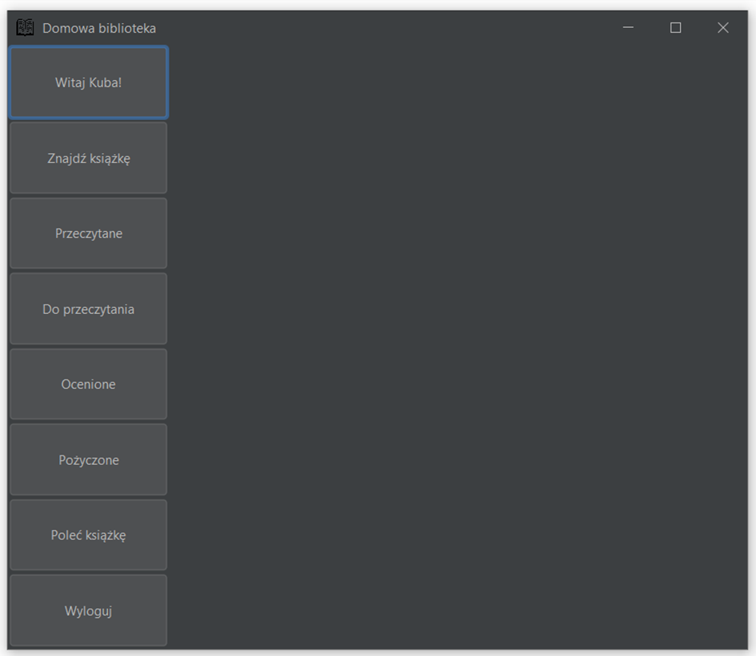
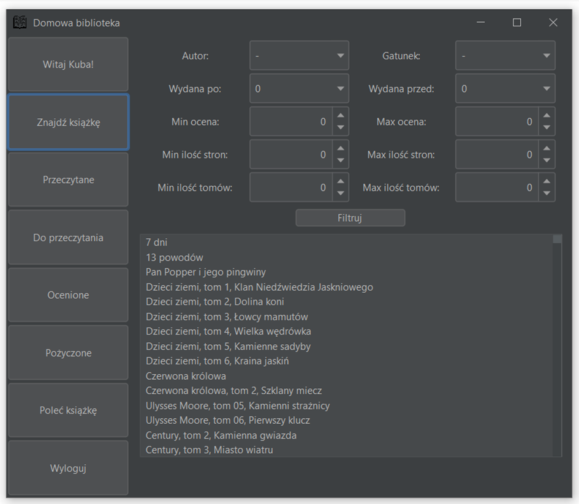
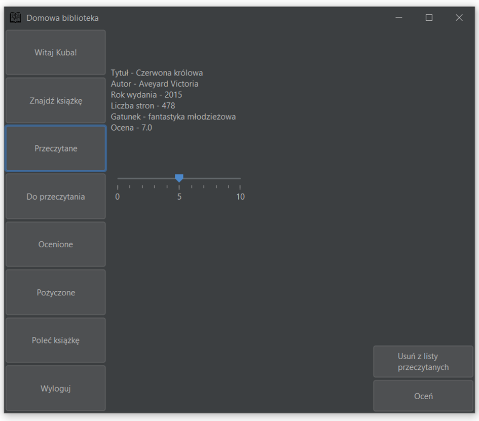
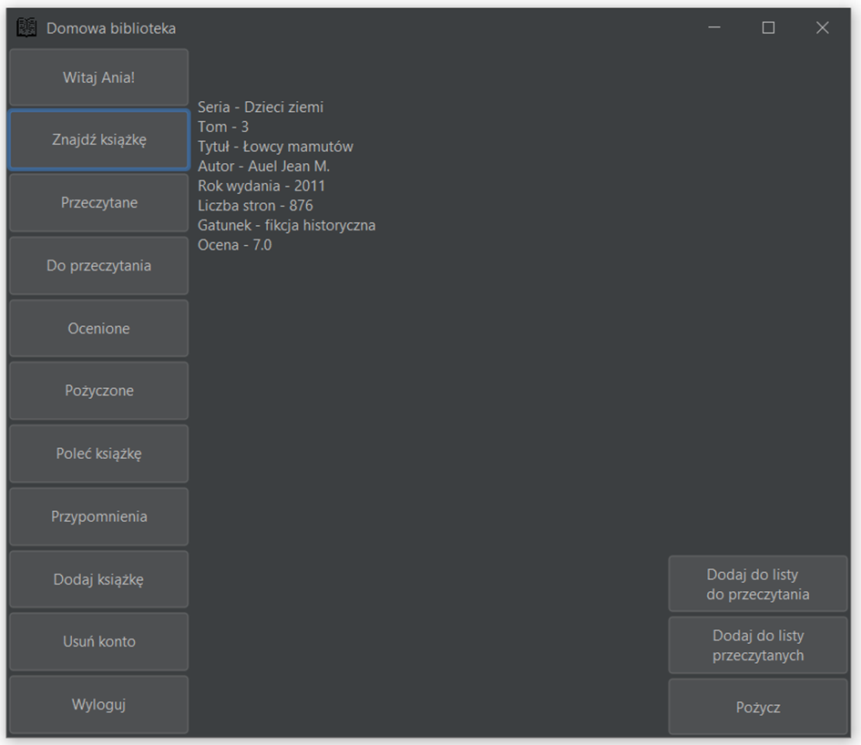
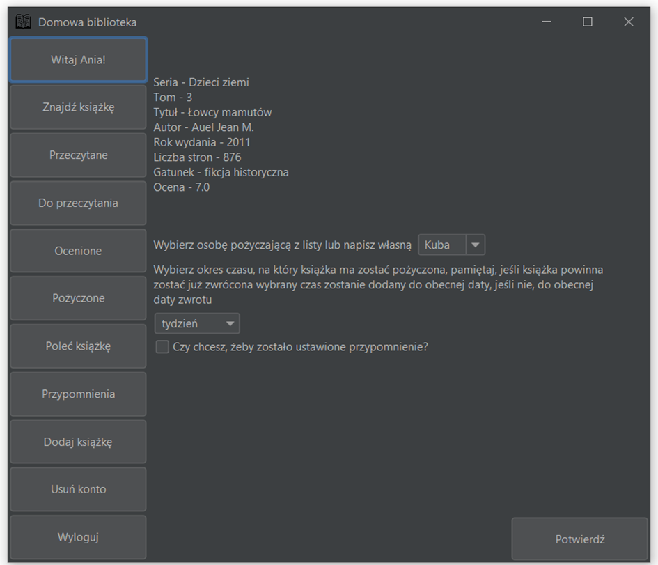
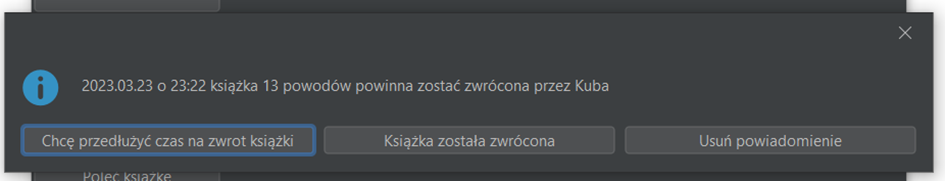
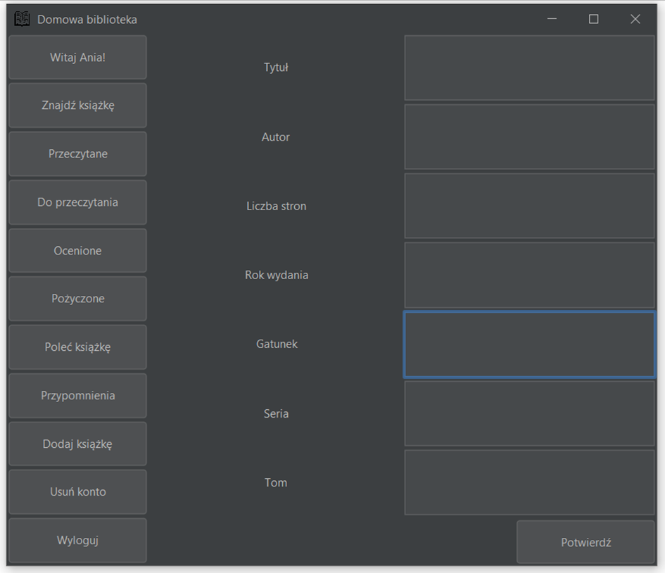
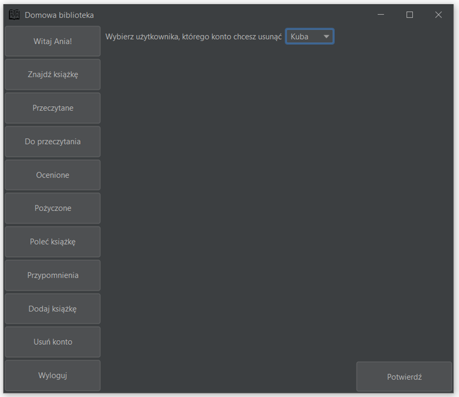

# HomeLibrary
An application that is used to manage a home book collection.

## Authors
Anna Szymańska, Dorota Wlazło

## Requirements
- Java19
- FlatLaf https://search.maven.org/artifact/com.formdev/flatlaf/3.1/jar?eh=

## Functionality
1.	The application loads a csv file with books.
2.	All available books can be searched using various filtering methods.
3.	Books can be added to a list of borrowed books and reminders can be set so that the application informs when the return should take place.
4.	The application allows users to create accounts, with the first one created becoming the administrator account. Each user can add books to a list of read books and a list of books they want to read. Users can also rate books.
5.	The application contains an algorithm that recommends further readings to users based on the books they have already read and the ratings given by other users.
6.	Users can log in to their account using a login mechanism. Information about lists created by the user is saved by the application (serialization mechanism) and loaded upon the next login/startup.
7.	The application allows for the addition of new books.

## Usage

After launching the application, a login panel is displayed as shown in Figure 1. The "Zarejestrujr" button allows for the registration of a new user. After entering the correct login details and clicking the "Zaloguj" button, the user is taken to the main application panel, which looks slightly different depending on whether the user is an administrator or not.

 On the left side of the main panel there is a column of buttons with actions that can be performed by the user. After clicking on a selected button, the field located on the right side changes its content depending on which button it was.

 Selecting the "Znajdź książkę" option changes the content of the panel as shown in Figure 4. At the top, there is a series of elements allowing to set the search criteria for the books loaded into the application. After clicking the "Filtruj" button, a list of books that meet the criteria selected by the user appears at the bottom of the panel. It is possible to set multiple criteria at once. 
 

Clicking on a specific book allows the user to add it to the list of read or to-be-read books.

 After clicking on the "Przeczytane" field, a list of books added to it by the user is displayed (Figure 5). 

Clicking on a book that has already been added to the "Przeczytane" list displays a panel that contains all the information about the book and allows the user to rate it (Figure 6).

The view for the administrator after clicking on a searched book (Figure 7) is different from the user's because in addition to adding it to a list, they also have the option to borrow the book to an existing library user or a new person. It is possible to set the borrowing period and schedule a reminder notification (Figure 8).

Another option available only to the administrator is adding new books to the database (Figure 10). The administrator must fill in all the fields with information about the added book and then confirm them with a button.

The administrator can also delete an existing user account (Figure 11).

